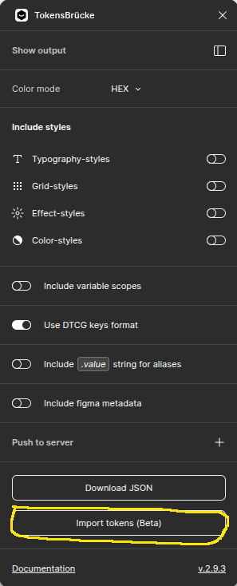
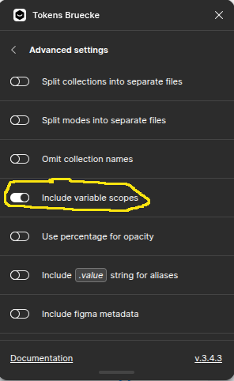
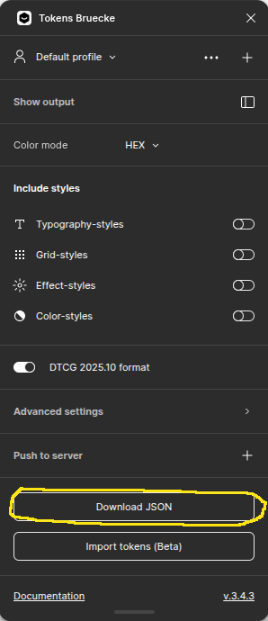

# Use Figma `TokensBrücke` plugin

- [github](https://github.com/tokens-bruecke/figma-plugin)
- [figma plugin page](https://www.figma.com/community/plugin/1254538877056388290/tokensbrucke)

## Install

Install the `TokensBrücke` plugin from the Figma Community.

## Import the tokens

> [!CAUTION]
> First remove all existing tokens from the `Variables` panel.

Then open the `TokensBrücke` plugin, and click on the `Import tokens` button.

Pick the `figma.tokens.json` file to import, and you're done.

> [!NOTE]
> Sometimes, Figma struggles to import the tokens in one pass.
> If that happens, re-import the tokens without removing the existing tokens imported from the previous pass.

## Export the tokens

Open the `TokensBrücke` plugin,
ensure that the `DTCG` toggle is active, as well as `include variable scopes`:

And click on the `Download JSON` button.

