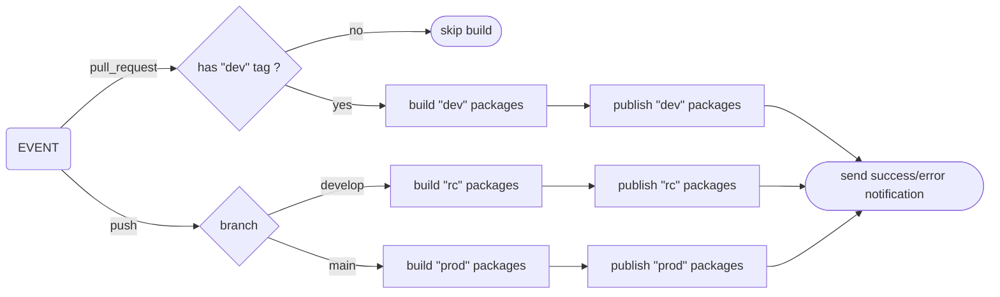

# Infomaniak's Design System - SVGs

Contains the list of Infomaniak's Design System SVGs.

## Figma design file

TODO: add a link to the Figma design file.

The [Figma svg assets design](https://www.figma.com/design/fjSRAikJq01Dof4iXazaPL/Tests-icons-Valentin?node-id=0-1&p=f&t=FMVSOZJWJiyGBzbW-0) contains all the SVGs used in the Infomaniak's Design System.

It is the **source of truth** for the SVGs.

### Rules

TODO define how icons/illustrations are organized in the Figma design file.

### Metadata

Metadata can be added to individual svg from the Figma design file by setting a description with special syntax:

#### Tags

A tag is a keyword that can be used to alias the SVGs.

Tags can be added using the following syntax:

```txt
#<tag>
```

Where `<tag>` is a tag name.

##### Example

```txt
#house #home #main
```

#### Projects

Projects are a way to group SVGs by projects.

SVGs can be assigned to a project using the following syntax:

```txt
@<project>
```

Where `<project>` is a project name.

##### Example

```txt
@kdrive @knote
```

> [!NOTE]
> Tags and projects can be mixed: `#house @kdrive`

## Workflow

### Add a new SVG

UX designers can add a new SVG to the Figma design file following the previous rules.

### Commit the changes

When satisfied, UX designers can commit the changes to the Figma design file by creating a new version.

---

TODO

A call on the endpoint:

```shell
curl -X POST \
  -H "Accept: application/vnd.github+json" \
  -H "Authorization: Bearer <CI_WORKFLOW_TRIGGER_DESIGN_SYSTEM_TOKEN>" \
  https://api.github.com/repos/infomaniak/design-system/actions/workflows/import-figma-svg-assets.yml/dispatches \
  -d '{"ref":"main"}'
```

triggers a Github workflow to import the SVGs from the Figma svg assets design file.

> [!NOTE]
> Replace `<CI_WORKFLOW_TRIGGER_DESIGN_SYSTEM_TOKEN>` with a personal access token having the requested permissions.

### Icons

> An icon is a **monotone** SVG: we may replace the color of each icon.

The Figma design file is traversed by a script to extract the icons.

Each icon is converted to an SVG, is optimized by SVGO, we replace the colors by `currentColor` (to make them _monotone_) and,
for each of them, we store the SVG into the `assets/svg/monotone/figma` directory as well as the metadata.

Then a single [iconify JSON](https://iconify.design/docs/libraries/tools/export/json.html) file (`assets/server/esds.json`) is generated containing all the icons.

### Illustrations

> An illustration is a **colored** SVG: a SVG with more than one color.

The Figma design file is traversed by a script to extract the illustrations.

Each illustration is converted to an SVG, is optimized by SVGO, and,
for each of them, we store the SVG into the `assets/svg/illustration/figma` directory as well as the metadata.

Then a single iconify JSON file (`assets/server/esds-illustration.json`) is generated containing all the illustrations.

### Graph


