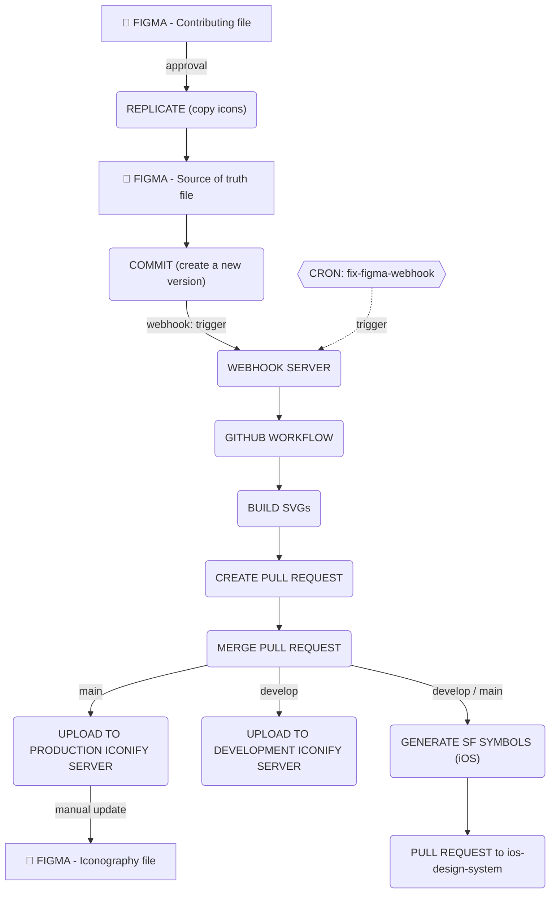

# Infomaniak's Design System - SVGs

Contains the list of Infomaniak's Design System SVGs.

- [Documentation ↗](https://infomaniak.github.io/design-system/storybook/main/?path=/docs/components-getting-started--docs)
- [Gallery ↗](https://infomaniak.github.io/design-system/storybook/main/?path=/docs/icons-icon-gallery--docs&collection=esds)
- [Iconography Guideline ↗](https://www.figma.com/design/nbEPxwoIzXfZVquwR4NfYg/Edelweiss---Iconography?node-id=0-1&p=f&t=50O2v4pgV2smKfy8-0)

## Workflow

### Add a new SVG

#### Icons

##### [Contribute](https://www.figma.com/design/GiBEx5gisOnNe3cikN0z1U/Edelweiss---System-icons---Contribution?m=auto&fuid=1007627152736665096)

This is the entry point for the UX designers to **propose** additions of new icons, or changes on existing ones.

Then, the UX designer must inform/request the design-system's team for approval, following our governance process to jump on the next steps.

##### [Source of truth](https://www.figma.com/design/VfpVYoNSwpoUfPTvWU3HdU/ESDS-Team---System-icons---Source-of-truth?node-id=2-8276&p=f&t=oWTzzbQevviolOKO-0)

When the changes/additions are approved, the design-system team's will replicate the additions/changes into the [source of truth](https://www.figma.com/design/VfpVYoNSwpoUfPTvWU3HdU/ESDS-Team---System-icons---Source-of-truth?node-id=2-8276&p=f&t=oWTzzbQevviolOKO-0) Figma file.

##### Rules

- icons must be converted into components.
- icons must have a name following this format: `esds/icon/<name>`, where `name` is `dash-cased`.
- icons may have descriptions to add _tags_ and _categories_ (see [Metadata](#Metadata)).

### Commit the changes

When complete, design-system's UX designers commit the changes to the Figma design file by creating a new version and updating the corresponding text node.

The version must follow the [semver convention](https://devhints.io/semver).

### Workflow trigger

A figma webhook is configured to trigger the Github workflow `on-figma-event` when a new version is created.

### Build the assets

The script import the Figma design file and generate the SVGs as well as the iconify JSON file.

#### Icons

> An icon is a **monotone** SVG: we may replace the color of each icon.

The Figma design file is traversed by a script to extract the icons.

Each icon is converted to an SVG, is optimized by SVGO, we replace the colors by `currentColor` (to make them _monotone_) and,
for each of them, we store the SVG into the `assets/svg/monotone/figma` directory as well as the metadata.

An **outlined** version of each icon (`<name>.outline.svg`) is also generated into the `assets/svg/monotone/figma/outlines` directory, using the Figma vector geometry (`fillGeometry`/`strokeGeometry`) so every stroke becomes a filled path. Outlines are excluded from the iconify set and are committed to this repository: they feed the [SF Symbols generation](#generate-the-sf-symbols-ios) for iOS.

Then a single [iconify JSON](https://iconify.design/docs/libraries/tools/export/json.html) file (`assets/server/esds.json`) is generated containing all the icons.

#### Illustrations

> An illustration is a **colored** SVG: a SVG with more than one color.

The Figma design file is traversed by a script to extract the illustrations.

Each illustration is converted to an SVG, is optimized by SVGO, and,
for each of them, we store the SVG into the `assets/svg/illustration/figma` directory as well as the metadata.

Then a single iconify JSON file (`assets/server/esds-illustration.json`) is generated containing all the illustrations.

### Merge the assets

A Pull Request is created to merge the assets into the `main` branch.

### Upload the assets

When the Pull Request is merged, the assets are uploaded to the Infomaniak's Design System iconify server.

### Generate the SF Symbols

When the Pull Request is merged, the [publish workflow](/.github/workflows/publish.yml) regenerates the [SF Symbols](https://developer.apple.com/sf-symbols/) asset catalog for iOS and delivers it to the [ios-design-system](https://github.com/Infomaniak/ios-design-system) repository, mirroring how the design tokens are delivered to the same repository. Deliveries triggered by `develop` ship a prerelease version (`-rc.<run>`), deliveries triggered by `main` ship the proper version.

```shell
yarn generate:sf-symbols
```

The command fits each committed outline (see [Icons](#icons)) into the official Apple SF Symbols template and emits the `ESDSSymbols.xcassets` catalog, with one custom symbol per icon named `esds-<name>` (e.g. `esds-magnifying-glass`). The publish step clones `ios-design-system`, replaces `Sources/ESDSSymbols/Symbols.xcassets`, pushes a branch `esds-symbols/<version>` and opens a pull request to `main`. When no outline has been imported yet, the publish step is skipped (non-blocking).

### Update the guidelines

#### [Iconography Guideline](https://www.figma.com/design/nbEPxwoIzXfZVquwR4NfYg/Edelweiss---Iconography?node-id=0-1&p=f&t=50O2v4pgV2smKfy8-0)

The UX designer updates manually the icons present into the reference file used by other UX designers.

### Graph



---

### Metadata

Metadata can be added to individual svg from the Figma design file by setting a description with special syntax:

#### Tags

A tag is a keyword that can be used to alias the SVGs.

Tags can be added using the following syntax:

```txt
#<tag>
```

Where `<tag>` is a tag name.

##### Example

```txt
#house #home #main
```

#### Categories

Categories are a way to group SVGs by projects or categories.

SVGs can be assigned to a project using the following syntax:

```txt
@<category>
```

Where `<category>` is a project name or a category type of icons.

##### Example

```txt
@kdrive @knote
```

> [!NOTE]
> Tags and categories can be mixed: `#house @kdrive`

---

## LEGACY

Legacy SVGs are stored in the `assets/svg/monotone/legacy` directory.

They are not used anymore, but they are kept for backward compatibility on existing projects.

### Import new legacy SVGs

1. Create a new branch: `feat/add-legacy-svgs`
2. Build them `manually` running:

```shell
yarn build:legacy-svgs
```

This script generates the appropriate `assets/server/*.json` files, and bump this `package.json` version.

3. Commit the changes
4. Create a Pull Request and follow the CONTRIBUTING guidelines
