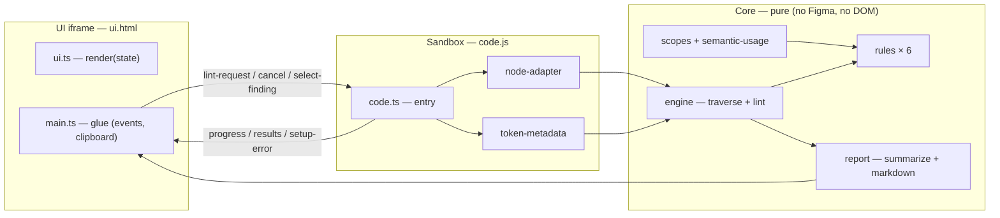

# Infomaniak's Design System - Figma Design Linter

A Figma plugin that lints a selection for design-token compliance. A designer selects
one or more layers, runs the plugin, and gets a list of errors and warnings: raw
(unbound) values, variables used outside their intended scope, semantic tokens used on
the wrong property, primitive tokens used where semantic tokens are expected, tokens
bound from unrecognized collections, and bindings that cannot be resolved.

The plugin is **read-only** — it reports, it never modifies the document.

## What it checks

| Rule               | Severity | Meaning                                                                                             |
| ------------------ | -------- | --------------------------------------------------------------------------------------------------- |
| Unbound value      | Error    | Property set with a raw value (`#4A90D9`, `16px`…) and no design token bound                        |
| Wrong scope        | Error    | A variable IS bound, but its Figma scopes don't cover the property (e.g. a stroke token on a fill)  |
| Wrong token        | Error    | A semantic (t2) color variable IS bound, but its category doesn't match the property                |
| Primitive misuse   | Warning  | The bound token effectively resolves to a primitive (t1) token — directly or through an alias chain |
| Unknown collection | Warning  | A variable IS bound, but points at no known token tier (t1/t2/t3)                                   |
| Unresolved token   | Warning  | A variable IS bound, but it can't be resolved from this file's variables or an accessible library   |

**Alias chains**: a variable's value may be an alias to another variable. This is what
lets third-party tokens (e.g. a Shadcn kit's `foreground`) be re-pointed to DS tokens
in Figma: when the alias chain resolves to a t2/t3 token, the binding is **accepted**
— no warning fires. Chains landing on a t1 token are still flagged as primitive
misuse, and chains that dead-end (raw value, deleted target, cycle) keep the
unknown-collection warning. Wrong-token is deliberately not validated through the
chain (the alias only affects tier classification).

The "wrong token" rule derives the category of a bound variable from its own name
(`color/background/…`, `color/content/…`) — read live from the file, so it can't drift
from the token set:

| `color.*` category | Frame fill | Shape / icon fill | Text fill | Stroke |
| ------------------ | ---------- | ----------------- | --------- | ------ |
| `background`       | ✓          | ✓                 | ✗         | ✗      |
| `content`          | ✗          | ✓                 | ✓         | ✗      |
| `border`           | ✗          | ✗                 | ✗         | ✓      |
| `shadow`           | ✗          | ✗                 | ✗         | ✗      |

- Checked properties: colors (fills & strokes, incl. text color), auto-layout padding
  & gap, corner radius. Uniform multi-part values (same value and binding on all
  padding sides / corners) are merged into a single finding
- Silently skipped: typography, effects, gradients, image/video fills, hidden layers
  (and their subtrees), mixed values, zero-valued padding/gap/radius, and anything the
  rules can't classify
- Component instances **are** linted: overrides applied on an instance are the
  designer's responsibility, and bindings inherited from the source component are
  reported too. Token-bound findings display the token's collection
  (`color/content/primary · t2`) so unrecognized collections are immediately visible

## Using the plugin in Figma

> [!NOTE]
> The plugin reads the design tokens **live from the file's variables** — variables
> local to the file, or bound from a published library, resolved on demand through the
> Figma Variables API. A file without any token variables still lints raw values via
> the unbound-value rule.

### Build and install (development)

```shell
yarn build:figma-lint-plugin
```

Then, in the Figma desktop app:

1. Go to **Plugins → Development → Import plugin from manifest…**
2. Select `packages/figma-lint-plugin/dist/manifest.json`

> [!NOTE]
> The manifest `id` is a placeholder until the first desktop import assigns the real
> plugin id. Distribution to the org is done as a private plugin (see the spec's
> rollout plan).

### Run a lint

1. Select one or more frames or layers on the canvas
2. Open the plugin and hit **Run lint**
3. Results appear as `N errors · M warnings`, errors first — each row shows the rule,
   the layer name and the offending value
4. Click a finding to select the offending layer on canvas (and zoom to it)
5. Hit **Copy report** to get a markdown summary for handoff tickets
6. Fix the layers and hit **Run again** — results are a snapshot, there is no live watching

| State       | Reached when                   | Content                                                                            |
| ----------- | ------------------------------ | ---------------------------------------------------------------------------------- |
| Idle        | Plugin opened, nothing run yet | Title, Run button, hint                                                            |
| Setup error | No selection                   | Blocking message with recovery hint + Retry                                        |
| Running     | Run clicked                    | `Checking layers…` shimmer, then `Checking 340/1200 layers…`, progress bar, Cancel |
| Results     | Run finished or cancelled      | Counts, findings grouped by severity, Run again + Copy report                      |
| Clean pass  | Run finished, zero findings    | "0 errors, 0 warnings — all checked properties are token-bound.", Run again        |

> [!NOTE]
> If the file's variables carry no scopes, the wrong-scope rule stays dormant — the
> wrong-token rule is unaffected.

## Architecture

Three layers with dependencies pointing inward: the Figma sandbox and the UI iframe
both reduce to thin adapters around a **pure core** that runs in plain Vitest without
the `figma` global.



- **`core/`** — pure functions and types: the data model (`LintNode` tree → property
  observations), the rules (pure functions over observations), the traversal +
  lint engine (progress, cancellation via cooperative yields), scope/semantic-usage
  helpers, and the report builders
- **`sandbox/`** — thin adapter over the Figma plugin runtime: converts the Figma
  selection into `LintNode`s, preloads token metadata once per run (local variables in
  bulk, then bound ids resolved on demand — collections → tiers, variable names →
  semantic categories, scopes), and posts messages to the UI
- **`ui/`** — the plugin panel: a pure state → DOM renderer plus a small bootstrap
  that wires clicks (run/cancel/copy/select) and sandbox messages

One run: `Run` → sandbox reads the selection → token metadata preloaded → node tree
adapted → engine traverses and evaluates the rules → findings summarized → posted to
the panel → click a row → sandbox selects and zooms to the node.

### Extending

- **Add a rule**: one file in `src/core/rules/` + one line in `registry.ts` — rules
  are pure functions over `PropertyObservation`s and never traverse the tree
- **Add a checked property** (e.g. effects in v2): extend the extraction in
  `sandbox/node-adapter.ts` + the required scopes in `core/scopes.ts`; existing rules
  pick it up via their `appliesTo` list

## Development

```shell
# build the plugin into dist/ (code.js, ui.html with inlined bundle, manifest.json)
yarn build:figma-lint-plugin

# run this package's tests (from the repo root)
yarn vitest run packages/figma-lint-plugin
```

Tests are co-located with their modules (`*.test.ts`) and the package enforces the
repo's 100% coverage threshold (the entry-point glue — sandbox entry, iframe
bootstrap, build script — is excluded explicitly in the root `vitest.config.ts`).

Manual smoke checklist after a build (per the implementation plan):

- Frame with a planted raw fill → error
- Content token on a background → error
- Background token on text → error
- Primitive radius → warning
- t1 token bound on an instance fill → primitive-misuse warning
- Token bound from an unrecognized collection (e.g. a third-party kit) → unknown-collection warning
- Third-party token aliased to a t2/t3 token → accepted
- Third-party token aliased to a t1 token → primitive-misuse warning
- Instance + hidden layers → hidden skipped, instance linted
- Token bound from a published library → classified correctly
- Token bound to a deleted variable → unresolved-token warning
- Check the file's variables carry scopes (see note above)
