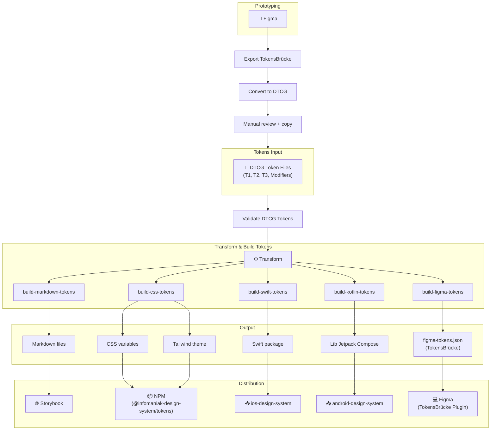

[](https://www.npmjs.com/package/@infomaniak-design-system/tokens)


# Infomaniak's Design System - DTCG Tokens

Contains the list of Infomaniak's Design System tokens based on the [Design Tokens Community Group - (DTCG - 2025.10)](https://www.designtokens.org/tr/2025.10/format) format, and scripts to convert them to different formats (CSS, Figma, Tailwind, etc.).

- [Documentation ↗](https://infomaniak.github.io/design-system/storybook/main/?path=/docs/design-tokens-getting-started--docs)

## Project architecture



## Definition

A `design token` is a pair consisting of a **name** and a **value**.
They're assembled into a list of tokens to apply styles to elements.

## File structure

- `tokens`: Contains the list of all the tokens used by the design system.
  - `t1-primitive`: Contains the _primitive_ tokens: it's a list of all the possible values to use for the design tokens.
    Developers should not use these values directly in their code, as they should rely on more abstract tokens (see t2, t3).
  - `t2-semantic`: Contains the _semantic_ tokens: it's a list of token's having a semantic meaning (ex: "color.brand").
    All the values of these tokens are pointing to the `t1-primitive` tokens: they can't have their own values.
  - `t3-component`: Contains the _component_ tokens: it's a list of tokens that are used to style components or elements of the interface.
    All the values of these tokens are pointing to the `t1-primitive` or `t2-semantic` tokens: they can't have their own values.
  - `modifiers`: Contains the list of tokens that are used as alternate values for the `t2-semantic` and `t3-component` tokens.

## Modifiers

- `contexts` are set of tokens associated with a `context` name that can be used to provide alternative values for the tokens.
- `contexts` are grouped by `modifier`:
  - Each `context` can only be used once per modifier.
  - Multiple `modifiers` can be combined to create the final set of tokens.

### Example

- `modifiers`:
  - `theme`:
    - `light.tokens.json`: Contains the tokens for the light theme.
    - `dark.tokens.json`: Contains the tokens for the dark theme.
  - `platform`:
    - `mobile.tokens.json`: Contains the tokens for the mobile platform.
    - `desktop.tokens.json`: Contains the tokens for the desktop platform.

In this example, developpers can use `light` OR `dark` _theme_ (but not both at the same time)
and `mobile` OR `desktop` _platform_.

`light`, `dark`, `mobile` and `desktop` are _contexts_ and `theme` and `platform` are _modifiers_.

## Platforms

### Web

The tokens are published as a npm package: `@infomaniak-design-system/tokens`.

#### CSS

The `css/tokens.root.css` file contains all the _base_ tokens as CSS variables and must be imported in every project.

The `css/modifiers/<modifier>/<context>.(root|attr).css` contains the tokens for the given modifier and context.

> [!NOTE]
> The `root` suffix contains the tokens wrapped by the selector: `:root, :host`
> The `attr` suffix contains the tokens wrapped by the attribute selector: `[data-esds-<modifier>="<context>"]`

##### Import

You may import the CSS files as you prefer, but here's an example of how to use them:

```css
/* src/styles/esds/tokens.css */
@import '@infomaniak-design-system/tokens/css/tokens.root.css';
```

```css
/* src/styles/esds/themes/light.css */
@import '@infomaniak-design-system/tokens/css/modifiers/theme/light.root.css';
```

```css
/* src/styles/esds/themes/dark.css */
@import '@infomaniak-design-system/tokens/css/modifiers/theme/dark.root.css';
```

```css
/* src/styles/esds/modifiers.css */
@import '@infomaniak-design-system/tokens/css/modifiers/button-size/small.attr.css';
@import '@infomaniak-design-system/tokens/css/modifiers/button-type/primary.attr.css';
/* etc. */
```

```html
<!-- index.html -->
<link
  rel="stylesheet"
  href="src/styles/esds/tokens.css"
/>
<link
  rel="stylesheet"
  href="src/styles/esds/themes/light.css"
  media="(prefers-color-scheme: light)"
/>
<link
  rel="stylesheet"
  href="src/styles/esds/themes/dark.css"
  media="(prefers-color-scheme: dark)"
/>

<link
  rel="stylesheet"
  href="src/styles/esds/modifiers.css"
/>
```

##### Usage

```html
<body
  data-esds-theme="dark"
  data-esds-product="mail"
>
  <!-- Dark theme and product mail applies to children -->
</body>
```

#### Tailwind

The npm package contains a `tailwind.css` file that you can import and use in your Tailwind project:

```css
/* src/styles/tailwind.css */
@import 'tailwindcss';
@import '@infomaniak-design-system/tokens/css/tokens.root.css';
@import '@infomaniak-design-system/tokens/tailwind.css';
```

```html
<!-- index.html -->
<link
  rel="stylesheet"
  href="src/styles/tailwind.css"
/>

/* ... */

<button class="bg-brand-default">Click me!</button>
```

### iOS

#### Swift

The package is published into [a dedicated GitHub repository](https://github.com/Infomaniak/ios-design-system).

##### Installation

```swift
swift.package(url: "https://github.com/Infomaniak/ios-design-system", branch: "main")
swift.target(
    name: "MyTarget",
    dependencies: [
        .product(name: "DesignSystem", package: "ios-design-system")
    ]
)
```

### Android

#### Kotlin

The package is published into [a dedicated GitHub repository](https://github.com/Infomaniak/android-design-system).

##### Installation

TODO

## Figma bridge

Figma does not provide a way to import or export tokens directly (without the Enterprise plan).
Thus, we have to perform a manual process.

> [!NOTE]
> We use the Figma [TokensBrücke plugin](../../docs/figma/tokens-bruecke/figma-tokens-bruecke.md) to import/export the figma variables.

### Export the tokens from figma

Follow [the instructions](../../docs/figma/tokens-bruecke/figma-tokens-bruecke.md) to export the tokens from figma, with the name `tokens.json`.

Then put this file at this destination `packages/tokens/scripts/scripts/convert-figma-tokens/tokens/tokens.json`.

Go to `packages/tokens`, and run the following command:

```shell
yarn convert-figma-tokens
```

It will export the tokens into `packages/tokens/tokens/**`, with a valid DTCG format.

### Import the tokens into figma

Go to `packages/tokens`, and run the following command:

```shell
yarn build
```

Open the file `packages/tokens/dist/figma.tokens.json`, copy its content, and follow [the instructions](../../docs/figma/tokens-bruecke/figma-tokens-bruecke.md) to import the tokens into figma.
