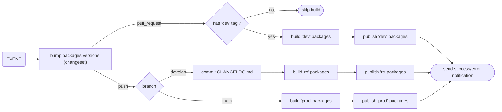

# Release Workflow Handover

> Technical handover for the release workflow (monorepo) and integration guide for future publishable libraries.

## Purpose

This document describes:

- the current publishing workflow (`PR` / `develop` / `main`)
- the scripts involved
- the CI environment contract
- how to make a new library compatible with CI publishing without duplicating logic

## Workflow Summary

### 1. Pull Request to `main` or `develop`

- The `publish.yml` workflow runs on `pull_request`
- The `yarn ci:publish` step runs **only if** the PR has the `dev` label
- Impacted packages are published as:
- `x.y.z-dev.<timestamp>`
- npm dist-tag: `dev`

### 2. Push to `develop`

- Impacted packages are published as:
- `x.y.z-rc.<timestamp>`
- npm dist-tag: `rc`

### 3. Push to `main`

- Stable publication:
- `x.y.z`
- npm dist-tag: `latest`
- Only if `name@x.y.z` does not already exist on npm

### Graph

## Important Rules

- `package.json` files in the repo must keep stable versions (`x.y.z`)
- versions are automatically bumped by **changesets**
- `-dev` / `-rc` suffixes are generated in CI
- A single timestamp is shared across the whole CI run
- Internal dependents of an impacted package are republished on prerelease tags (`dev`/`rc`)

## Changesets (Versioning + Changelog)

Changesets are used to collect structured change descriptions and automate version bumps + changelog generation.
They operate during the `publish.yml` workflow and are configured in `.changeset/config.json`.

### Flow

1. The `create-release-pr.yml` workflow automatically creates a **draft PR** from `develop` → `main` whenever new changes land on `develop` (if no such PR already exists).
2. Developers create changeset files (`yarn changeset`) on their feature branches and commit them alongside code changes
3. Changes accumulate on `develop` as PRs merge.
4. When ready to release, a maintainer marks the draft PR as **Ready for review**.
5. This triggers `publish.yml`:
   - Automatically bumps the version via changesets:
     - Consumes all pending `.changeset/*.md` files
     - Bumps `package.json` versions (e.g. `0.2.4` → `0.3.0`)
     - Generates/updates `CHANGELOG.md` per package
     - Commits and pushes the result to `develop`
   - Publishes an `rc` version
6. The maintainer then merges the PR to `main`, which triggers `ci:publish` to publish the bumped versions as `latest` on the different platforms.

The version bump can also be run manually with `yarn changeset:version`, if needed.
It requires `GITHUB_TOKEN` so the changelog generator can link commits and PRs — run `export GITHUB_TOKEN=$(gh auth token)` first, or add it to your `.env` (see `.env.example`).

## How does it work ?

This repo is a monorepo based on `yarn workspaces`.

When the `publish.yml` workflow triggers, the `yarn ci:publish` script is run.

This script:

1. detects changed files via `git diff --name-only <base> <head>`
2. maps files to publishable packages (`packages/*`)
3. propagates impact to internal dependents (dependency graph)
4. compare the versions of the impacted packages with the latest published versions on npm
5. runs every `build` scripts present into the impacted packages:
   - command: `yarn workspaces foreach --topological-dev --recursive run build`
   - used to build the artifacts associated with each package.
6. runs every `publish` scripts present into the impacted packages:
   - command: `yarn workspaces foreach --topological-dev --recursive run publish`
   - used to publish the previously built artifacts associated with each package.
