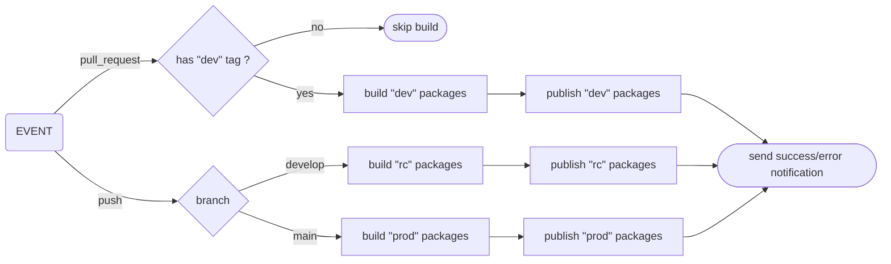

# Release Workflow Handover

> Technical handover for the npm release workflow (monorepo) and integration guide for future publishable libraries.

## Purpose

This document describes:

- the current publishing workflow (`PR` / `develop` / `main`)
- the scripts involved
- the CI environment contract
- how to make a new library compatible with CI publishing without duplicating logic

## Workflow Summary

### 1. Pull Request to `main` or `develop`

- The `publish.yml` workflow runs on `pull_request`
- The `yarn ci:publish` step runs **only if** the PR has the `dev` label
- Impacted packages are published as:
- `x.y.z-dev.<timestamp>`
- npm dist-tag: `dev`

### 2. Push to `develop`

- Impacted packages are published as:
- `x.y.z-rc.<timestamp>`
- npm dist-tag: `rc`

### 3. Push to `main`

- Stable publication:
- `x.y.z`
- npm dist-tag: `latest`
- Only if `name@x.y.z` does not already exist on npm

### Graph

## Important Rules

- `package.json` files in the repo must keep stable versions (`x.y.z`)
- `-dev` / `-rc` suffixes are generated in CI
- A single timestamp is shared across the whole CI run
- Internal dependents of an impacted package are republished on prerelease tags (`dev`/`rc`)

## Impacted Package Detection (prerelease)

For `dev` / `rc` prerelease tags, `scripts/ci/publish/src/ci-publish.ts`:

1. detects changed files via `git diff --name-only <base> <head>`
2. maps files to publishable packages (`packages/*`)
3. propagates impact to internal dependents (dependency graph)
4. publishes in topological order
